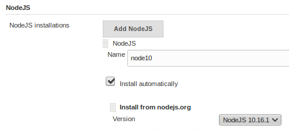

# Jest, React & Jenkins CI

## React & Jest

  - Axios calls with async/await in try catch block
  - mock axios.get()
  - setState to update wrapper

Install, test and run

```sh
$ npm install
$ npm test
$ npm start
```

open <http://localhost:3000>

## Jenkins CI

- Create pipeline using option `pipeline from SCM`
- make sure that NodeJS plugin is installed and set like on image

